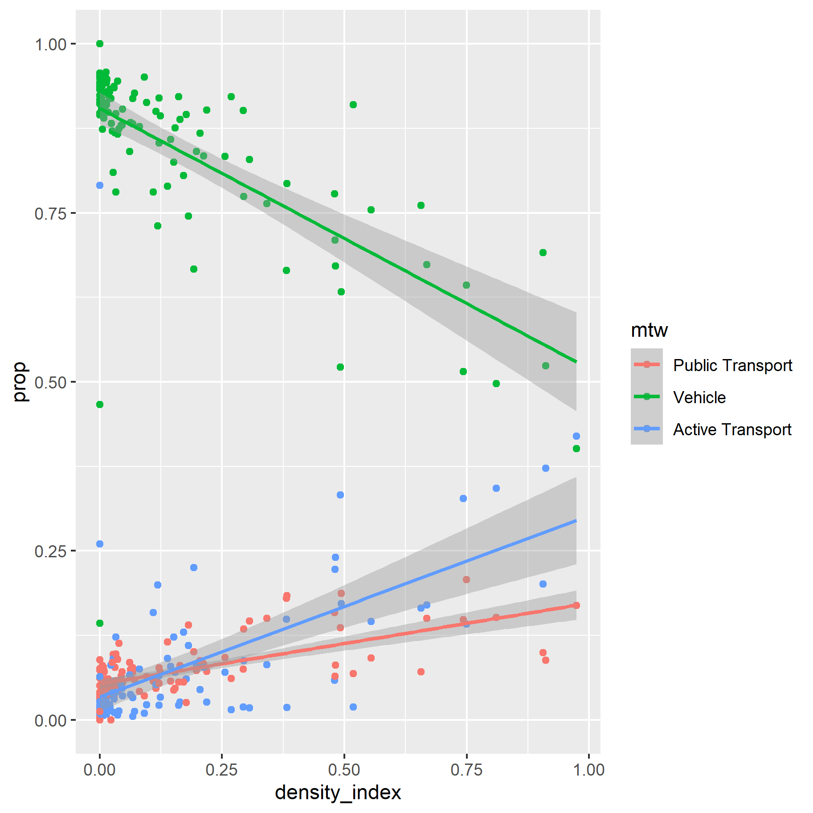

# cbr-housing-data

## Some results

These are the median rental ranges for the SA3 statistical areas in the ACT, divided up by the dwelling structure (simplified to three categories). 

How does the density of a suburb affect what method of travel someone uses to go to work?
